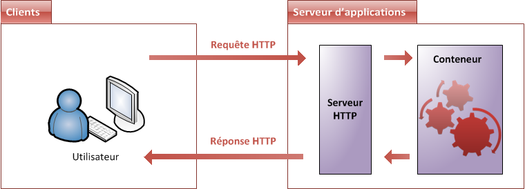
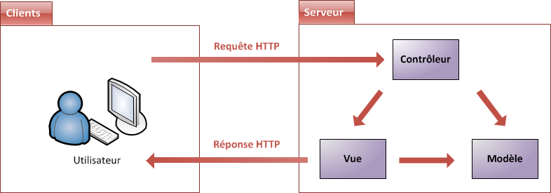

# Le Java EE mis à nu

Le Java Enterprise Edition, comme son nom l'indique, a été créé pour le développement d'applications d'entreprises. Nous nous y attarderons dans le chapitre suivant, mais sachez d'ores et déjà que ses spécifications ont été pensées afin, notamment, de faciliter le travail en équipe sur un même projet : l'application est découpée en couches, et le serveur sur lequel tourne l'application est lui-même découpé en plusieurs niveaux. Pour faire simple, Java EE fournit un ensemble d’extensions au Java standard afin de faciliter la création d’applications centralisées.

## Principes de fonctionnement

Nous venons de découvrir qu'afin de pouvoir communiquer entre eux, le client et le serveur doivent se parler via HTTP. Nous savons déjà que, côté client, le navigateur s'en occupe. 
Côté serveur, qui s'en charge ? C'est un composant que l'on nomme logiquement serveur HTTP. 
Son travail est simple : il doit écouter tout ce qui arrive sur le port utilisé par le protocole HTTP, le port 80, et scruter chaque requête entrante. 

Être capable de discuter via HTTP c'est bien, mais notre serveur doit permettre d'effectuer d'autres tâches. 
En effet, une fois la requête HTTP lue et analysée, il faut encore traiter son contenu et éventuellement renvoyer une réponse au client en conséquence. 
Vous devez probablement déjà savoir que cette responsabilité vous incombe en grande partie : c'est le code que vous allez écrire qui va décider ce qu'il faut faire lorsqu'une telle requête arrive ! 
Seulement, comme je viens de vous l'annoncer, un serveur HTTP de base ne peut pas gérer votre application, ce n'est pas son travail.

> Remarque : cette affirmation est en partie fausse, dans le sens où la plupart des serveurs HTTP sont devenus des serveurs web à part entière, incluant des plugins qui les rendent capables de supporter des langages de script comme le PHP, l'ASP, etc.

Ainsi, nous avons besoin d'une solution plus globale : ce composant, qui va se charger d'exécuter votre code en plus de faire le travail du serveur HTTP, se nomme le serveur d'applications. 
Donner une définition exacte du terme est difficile : ce que nous pouvons en retenir, c'est qu'un tel serveur inclut un serveur HTTP, et y ajoute la gestion d'objets de diverses natures au travers d'un composant que nous allons pour le moment nommer le conteneur.

Concrètement, le serveur d'application va :
* récupérer les requêtes HTTP issues des clients;
* les mettre dans des boîtes, des objets, que votre code sera capable de manipuler;
* faire passer ces objets dans la moulinette qu'est votre application, via le conteneur;
* renvoyer des réponses HTTP aux clients, en se basant sur les objets retournés par votre code.

Là encore, il en existe plusieurs sur le marché, que l'on peut découper en deux secteurs :
* les solutions propriétaires et payantes : WebLogic et WebSphere, respectivement issues de chez Oracle et IBM, sont les références dans le domaine. Massivement utilisées dans les banques et la finance notamment, elles sont à la fois robustes, finement paramétrables et très coûteuses.
* les solutions libres et gratuites : Apache Tomcat, JBoss, GlassFish et Jonas en sont les principaux représentants.

> Comment faire un choix parmi toutes ces solutions ?

Hormis les problématiques de coûts qui sont évidentes, d'autres paramètres peuvent influencer votre décision ; citons par exemple la rapidité de chargement et d’exécution, ainsi que la quantité de technologies supportées. 
En ce qui nous concerne, nous partons de zéro : ainsi, un serveur d'applications basique, léger et gratuit fera très bien l'affaire. 
Ça tombe bien, il en existe justement un qui répond parfaitement à tous nos besoins : Apache Tomcat.

Pour information, c'est d'ailleurs souvent ce type de serveurs qui est utilisé lors des phases de développement de grands projets en entreprise. 
Le coût des licences des solutions propriétaires étant élevé, ce n'est que lors de la mise en service sur la machine finale (on parle alors de mise en production) que l'on opte éventuellement pour une telle solution.

## Le modèle MVC : en théorie

> Qu'est-ce qu'un modèle de conception ?

En anglais design pattern, un modèle de conception (ou encore patron de conception) est une simple bonne pratique, qui répond à un problème de conception d'une application. 
C'est en quelque sorte une ligne de conduite qui permet de décrire les grandes lignes d'une solution.
De tels modèles sont issus de l'expérience des concepteurs et développeurs d'applications : c'est en effet uniquement après une certaine période d'utilisation que peuvent être mises en évidence des pratiques plus efficaces que d'autres, pratiques qui sont alors structurées en modèles et considérées comme standard.

> Que recommandent les développeurs Java EE expérimentés ?

Il faut bien vous rendre compte qu'à l'origine, Java EE permet plus ou moins de coder son application comme on le souhaite : en d'autres termes, on peut coder n'importe comment ! 
Or on sait que dans Java EE, il y a « Entreprise », et que ça n'est pas là pour faire joli ! 
Le développement en entreprise implique entre autres :
* que l'on puisse être amené à travailler à plusieurs contributeurs sur un même projet ou une même application (travail en équipe);
* que l'on puisse être amené à maintenir et corriger une application que l'on n'a pas créée soi-même;
* que l'on puisse être amené à faire évoluer une application que l'on n'a pas créée soi-même.

Pour toutes ces raisons, il est nécessaire d'adopter une architecture plus ou moins standard, que tout développeur peut reconnaître, c'est-à-dire dans laquelle tout développeur sait se repérer.

Il a été très vite remarqué qu'un modèle permettait de répondre à ces besoins, et qu'il s'appliquait particulièrement bien à la conception d'applications Java EE : le modèle MVC (Modèle-Vue-Contrôleur).
Il découpe littéralement l'application en couches distinctes, et de ce fait impacte très fortement l'organisation du code ! Voici dans les grandes lignes ce qu'impose MVC :
* tout ce qui concerne le traitement, le stockage et la mise à jour des données de l'application doit être contenu dans la couche nommée "Modèle" (le M de MVC);
* tout ce qui concerne l'interaction avec l'utilisateur et la présentation des données (mise en forme, affichage) doit être contenu dans la couche nommée "Vue" (le V de MVC);
* tout ce qui concerne le contrôle des actions de l'utilisateur et des données doit être contenu dans la couche nommée "Contrôle" (le C de MVC).

Ce modèle peut être représenté par la figure suivante.

## Le modèle MVC : en pratique

Le schéma précédent est très global, afin de vous permettre de bien visualiser l'ensemble du système.
Tout cela est encore assez abstrait, et c'est volontaire !
En effet, chaque projet présente ses propres contraintes, et amène le développeur à faire des choix.
Ainsi, on observe énormément de variantes dès que l'on entre un peu plus dans le détail de chacun de ces blocs.

Prenons l'exemple du sous-bloc représentant les données (donc à l'intérieur de la couche Modèle) :
* Quel est le type de stockage dont a besoin votre application ?
* Quelle est l'envergure de votre application ?
* Disposez-vous d'un budget ?
* La quantité de données produites par votre application va-t-elle être amenée à fortement évoluer ?
* ...

La liste de questions est souvent longue, et réalisez bien que tous ces points sont autant de paramètres qui peuvent influencer la conception de votre application, et donc vos choix au niveau de l'architecture. Ainsi, détailler plus finement les blocs composant une application n'est faisable qu'au cas par cas, idem pour les relations entre ceux-ci, et dépend fortement de l'utilisation ou non de frameworks…

> Qu'est-ce qu'un framework ?

Il est encore bien trop tôt pour que nous nous penchions sur ce sujet.
Toutefois, vous pouvez d'ores et déjà retenir qu'un framework est un ensemble de composants qui servent à créer l'architecture et les grandes lignes d'une application.
Vous pouvez le voir comme une boîte à outils géante, conçue par un ou plusieurs développeurs et mise à disposition d'autres développeurs, afin de faciliter leur travail.
Il existe des frameworks dans beaucoup de langages et plate-formes, ce n'est pas un concept propre à Java EE ni au développement web en particulier.

En ce qui concerne Java EE, nous pouvons par exemple citer JSF, Spring, Struts ou encore Hibernate. 
Toutes ces solutions sont des frameworks que les développeurs sont libres d'utiliser ou non dans leurs projets.

Bref, nous sommes encore loin d'être assez à l'aise avec la plate-forme Java EE pour étudier ces fameux frameworks, mais nous pouvons d'ores et déjà étudier les applications Java EE "nues", sans frameworks ni fioritures.
Voici donc une courte introduction de chacune des couches composant une telle application web suivant le modèle MVC.

### Modèle : des traitements et des données

Dans le modèle, on trouve à la fois les données et les traitements à appliquer à ces données.
Ce bloc contient donc des objets Java d'une part, qui peuvent contenir des attributs (données) et des méthodes (traitements) qui leur sont propres, et un système capable de stocker des données d'autre part.
Rien de bien transcendant ici, la complexité du code dépendra bien évidemment de la complexité des traitements à effectuer par votre application.

### Vue : des pages JSP

Une page JSP est destinée à la vue.
Elle est exécutée côté serveur et permet l'écriture de gabarits (pages en langage "client" comme HTML, CSS, Javascript, XML, etc.).
Elle permet au concepteur de la page d'appeler de manière transparente des portions de code Java, via des balises et expressions ressemblant fortement aux balises de présentation HTML.

### Contrôleur : des servlets

Une servlet est un objet qui permet d'intercepter les requêtes faites par un client, et qui peut personnaliser une réponse en conséquence.
Il fournit pour cela des méthodes permettant de scruter les requêtes HTTP.
**Cet objet n'agit jamais directement sur les données, il faut le voir comme un simple aiguilleur** : il intercepte une requête issue d'un client, appelle éventuellement des traitements effectués par le modèle, et ordonne en retour à la vue d'afficher le résultat au client.
