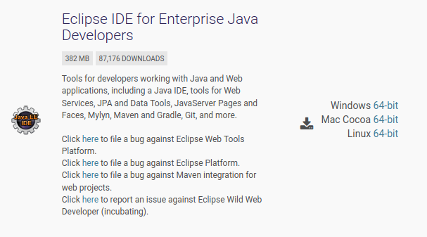
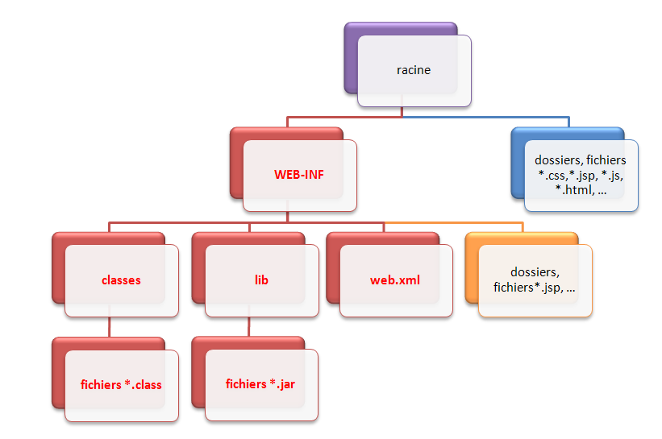
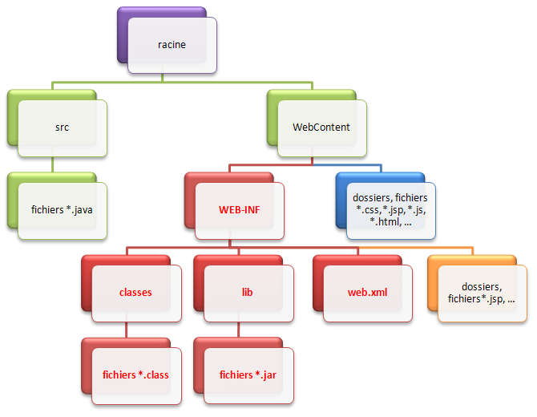

# Outils et environnement de développement

La création d'une application web avec Java EE s'effectue généralement à l'aide d'un **Environnement de Développement Intégré**, très souvent raccourci à l'anglaise en IDE.
C'est un logiciel destiné à faciliter grandement le développement dans son ensemble.
S'il est possible pour certains projets Java de s'en passer, en ne se servant que d'un éditeur de texte pour écrire le code et d'une invite de commandes pour mettre en place l'application, ce n'est sérieusement plus envisageable pour la création d'une application web complexe.
Nous allons donc dans ce chapitre apprendre à en utiliser un, et y intégrer notre serveur d'applications.

## L'IDE Eclipse

### Présentation

J'utiliserai l'IDE **Eclipse** tout au long de ce cours.
Ce n'est pas le seul existant, c'est simplement celui que je maîtrise le mieux.
Massivement utilisé en entreprise, c'est un outil puissant, gratuit, libre et multiplateforme.
Les avantages d'un IDE dans le développement d'applications web Java EE sont multiples, et sans toutefois être exhaustif en voici une liste :
* intégration des outils nécessaires au développement et au déploiement d'une application;
* paramétrage aisé et centralisé des composants d'une application;
* multiples moyens de visualisation de l'architecture d'une application;
* génération automatique de portions de code;
* assistance à la volée lors de l'écriture du code;
* outils de débogage…

### Téléchargement et installation

Comme vous pouvez le constater en vous rendant sur [la page de téléchargements](https://www.eclipse.org/downloads/packages/) du site, Eclipse est décliné en plusieurs versions.
Nous avons bien entendu besoin de la version spécifique au développement Java EE (voir la figure suivante).



Une fois le logiciel téléchargé, installez-le de préférence dans un répertoire situé directement à la racine de votre disque dur, et dont le titre ne contient ni espaces ni caractères spéciaux.
Typiquement, évitez les dossiers du genre "Program Files" et consorts.
Ce n'est pas une obligation mais un simple conseil, qui vous évitera bien des ennuis par la suite.

### Configuration

Ci-dessous, je vous donne quelques conseils pour configurer votre Eclipse efficacement.
Je ne vais pas vous expliquer en détail pourquoi ces réglages sont importants, faites-moi simplement confiance et suivez le guide !

#### Modification de l'encodage par défaut

Si vous ouvrez Eclipse pour la première fois, commencez par fermer l'onglet de bienvenue qui s'affiche.
Rendez-vous alors dans la barre de menus supérieure, et cliquez sur `Window`, puis `Preferences`.
Dans la fenêtre qui s'affiche alors, il y a un champ vous permettant de taper du texte en haut à gauche.
Saisissez-y le mot *"encoding"*, et dans chaque section qui apparaît alors dans le volet de gauche, changez l'encodage par défaut (il est généralement réglé à Cp1252 ou ISO-8859-1) par la valeur **UTF-8**.
Validez pour finir en cliquant sur `Ok` afin d'appliquer les modifications.

#### Désactivation de la vérification de l'orthographe

Rendez-vous à nouveau dans le menu `Window`\>`Preferences`, puis dans le volet de gauche rendez-vous dans `General`\>`Editors`\>`Text Editors`, et dans le volet de droite cochez la case *"Show line numbers"*.
Dans le volet de gauche, cliquez alors sur le sous-menu `Spelling`, et dans le nouveau volet de droite qui apparaît, décochez la case *"Enable spell checking"*.
Validez pour finir en cliquant sur `Ok` afin d'appliquer les modifications.


## Le serveur Tomcat

### Présentation

Nous l'avons découvert dans le second chapitre : pour faire fonctionner une application web Java EE, nous avons besoin de mettre en place un **serveur d'applications**.
Il en existe beaucoup sur le marché : j'ai, pour le début de ce cours, choisi d'utiliser **Tomcat**, car c'est un serveur léger, gratuit, libre, multiplateforme et assez complet pour ce que nous allons aborder.
On le rencontre d'ailleurs très souvent dans des projets en entreprise, en phase de développement comme en production.

> Pour information, sachez que Tomcat tire sa légèreté du fait qu'il n'est en réalité que l'assemblage d'un **serveur web** (gestion des requêtes/réponses HTTP) et d'un **conteneur web** (nous parlerons en temps voulu de **conteneur de servlets**, et reviendrons sur ce que cela signifie concrètement). Pour le moment, retenez simplement que ce n'est pas un serveur d'applications Java EE au sens complet du terme, car il ne respecte pas entièrement ses spécifications et ne supporte pas toutes ses technologies.

### Installation

Nous allons utiliser la dernière version en date à ce jour, à savoir **Tomcat 9**.
Rendez-vous sur [la page de téléchargement de Tomcat](https://tomcat.apache.org/download-90.cgi), puis choisissez et téléchargez la correspondant à votre système d'exploitation.

#### Sous Windows

Récupérez la dernière version *Core* au format zip, puis décompressez son contenu dans le répertoire où vous souhaitez installer Tomcat.
Au sujet du répertoire d'installation, même conseil que pour Eclipse : choisissez un chemin dont les noms de dossiers ne comportent pas d'espaces.
Dans ce répertoire d'installation de Tomcat, vous trouverez un dossier nommé **webapps** : c'est ici que seront stockées par défaut vos applications.
Pour ceux d'entre vous qui souhaiteraient jeter un œil à ce qui se passe derrière les rideaux, vous trouverez dans le dossier **conf** les fichiers suivants :
* **server.xml** : contient les éléments de configuration du serveur;
* **context.xml** : contient les directives communes à toutes les applications web déployées sur le serveur;
* **tomcat-users.xml** : contient entre autres l'identifiant et le mot de passe permettant d'accéder à l'interface d'administration de votre serveur Tomcat;
* **web.xml** : contient les paramètres de configuration communs à toutes les applications web déployées sur le serveur.

#### Sous Linux

Récupérez la dernière version Core au format tar.gz : une archive nommée apache-tomcat-9.0.xx.tar.gz est alors enregistrée sur votre poste, où xx correspond à la sous-version courante.
Au moment où j'écris ces lignes, la version est la 9.0.38 : **pensez à adapter les commandes qui suivent à la version que vous téléchargez**.
Décompressez ensuite son contenu dans le répertoire où vous souhaitez installer Tomcat. Par exemple :

```bash
cd /usr/local
mkdir tomcat
cd /usr/local/tomcat
cp ~/apache-tomcat-9.0.38.tar.gz .
tar -xvzf apache-tomcat-9.0.38.tar.gz
```

Un dossier nommé apache-tomcat-9.0.38 contient alors l'installation.
Vérifiez alors que l'installation s'est bien effectuée :

```bash
cd /usr/local/tomcat/apache-tomcat-9.0.38
cd bin
./version.sh
```

#### Sous Mac OS

Je n'ai malheureusement pas de machine tournant sous Mac OS et il faudra donc aller fouiller un peu sur le site officiel pour trouver le moyen de procéder.

### Création du projet web avec Eclipse

Depuis Eclipse, suivez le chemin suivant : `File > New > Project...`.
Ceci peut d'ailleurs être raccourci en tapant au clavier `Ctrl` + `N`.
Sélectionnez alors **Dynamic Web Project** puis cliquez sur `Next >`.
Appelez votre projet comme bon vous semble, ceci n'a pas beaucoup d'importance.
Cliquez sur le bouton `New Runtime...` et sélectionnez alors Apache Tomcat 9.0 dans la liste des possibilités.
Cochez la case *Create a new local server*, ce qui signifie que nous allons en plus du projet créer localement une nouvelle instance d'un serveur, instance que nous utiliserons par la suite pour déployer notre application.
Cliquez ensuite sur `Next >` et remplissez correctement les informations relatives à votre installation de Tomcat en allant chercher le répertoire d'installation de Tomcat sur votre poste.
Il faut alors indiquer le dossier d'installation du serveur d'application Tomcat sur votre machine.
Validez alors en cliquant sur `Finish`, puis cliquez sur `Next >` jusqu'à arriver sur une page de configuration du *Web module*.

Avant d'aller plus loin, nous devons parler de **contexte** !
Souvenez-vous, je vous ai déjà parlé d'un fichier **context.xml** associé à toutes les applications.
Pour permettre plus de souplesse, il est possible de spécifier un contexte propre à chaque *webapp*.
Comme je vous l'ai déjà dit, ces applications web sont empiriquement contenues dans le dossier… **webapps** de votre dossier d'installation Tomcat.
C'est ici que, par défaut, Tomcat ira chercher les applications qu'il doit gérer et déployer.
Jusque-là, vous suivez…

Le souci, et certains d'entre vous l'auront peut-être déjà compris, c'est que notre projet à nous, créé depuis Eclipse, se trouve dans un répertoire de notre workspace Eclipse : il n'est pas du tout dans ce fameux répertoire webapps de Tomcat.
Pour que notre serveur prenne en compte notre future application, il va donc falloir arranger le coup ! Plusieurs solutions s'offrent à nous :
* créer un répertoire du même nom que notre projet sous Eclipse, directement dans le dossier webapps de Tomcat, et y copier-coller nos fichiers, et ce à chaque modification de code ou configuration effectuée;
* créer un nouveau projet depuis Eclipse, en utilisant directement le répertoire *webapps* de votre dossier d'installation Tomcat comme *workspace* Eclipse;
* modifier le **server.xml** ou le **context.xml** de votre Tomcat, afin qu'il sache où chercher;
* utiliser les propriétés d'un projet web dynamique sous Eclipse.

Je vous conseille bien évidemment ici d'utiliser la quatrième et dernière solution.
Conservez le nom de votre projet sous Eclipse comme contexte de déploiement sur votre serveur Tomcat, afin de rester cohérent.
Toute modification sur vos futures pages et classes sera ainsi automatiquement prise en compte par votre serveur Tomcat, qui s'occupera de recharger le contexte à chaque modification sauvegardée, lorsque le serveur sera lancé.

Vous noterez l'apparition d'une entrée **Tomcat v9.0** dans l'onglet `Servers`, et de l'arborescence de votre projet dans le volet de gauche.
Faites maintenant un clic droit sur le titre de votre projet dans l'arborescence Eclipse, et suivez `Run As > Run on Server`.
Dans la fenêtre qui s'ouvre alors, nous allons sélectionner le serveur Tomcat que nous venons de mettre en place lors de la création de notre projet web, et préciser que l'on souhaite associer par défaut notre projet à ce serveur.
Cliquez alors sur `Next >`, puis vérifiez que votre nouveau projet est bien pris en compte par votre serveur.
Validez enfin en cliquant sur `Finish`, et voilà la mise en place de votre projet et de votre serveur terminée !

> Sachez pour finir, que cette manipulation n'est pas limitée à Tomcat. Vous pouvez utiliser d'autres types de serveurs, cela ne pose pas de problèmes. De même, une fois que vous avez correctement paramétré un serveur Tomcat depuis Eclipse, vous n'êtes pas forcés de recréer localement un nouveau serveur pour chacun de vos projets, vous pouvez très bien réutiliser la même instance de Tomcat en y déployant plusieurs applications web différentes.

Si vous êtes arrivés jusqu'ici, c'est que votre instance de serveur Tomcat est fonctionnelle et que vous pouvez la piloter depuis Eclipse. Voyons maintenant où placer notre premier essai, et comment y accéder.

## Structure d'une application Java EE

### Structure standard

Toute application web Java EE doit respecter une structure de dossiers standard, qui est définie dans les spécifications de la plate-forme.
Vous en trouverez le schéma à la figure suivante.



Quelques précisions :
* La racine de l'application, en violet sur le schéma, est le dossier qui porte le nom de votre projet et qui contient l'intégralité des dossiers et fichiers de l'application.
* Le dossier nommé WEB-INF est un dossier spécial. Il doit obligatoirement exister et être placé juste sous la racine de l'application. Il doit à son tour obligatoirement contenir :
    * le fichier de configuration de l'application (web.xml);
    * un dossier nommé **classes**, qui contient à son tour les classes compilées (fichiers .class);
    * un dossier nommé **lib**, qui contient à son tour les bibliothèques nécessaires au projet (archives .jar).
Bref, tous les dossiers et fichiers marqués en rouge sur le schéma doivent obligatoirement être nommés et placés comme indiqué sur le schéma.
* Les fichiers et dossiers persos placés directement sous la racine, en bleu sur le schéma, sont publics et donc accessibles directement par le client via leurs URL. **(\*)**
* Les fichiers et dossiers persos placés sous le répertoire WEB-INF, en orange sur le schéma, sont privés et ne sont donc pas accessibles directement par le client. **(\*)**

**(\*)** *Nous reviendrons en temps voulu sur le caractère privé du dossier ***WEB-INF***, et sur la distinction avec les dossiers publics.*

> Voilà tout concernant la structure officielle : si votre application n'est pas organisée de cette manière, le serveur d'applications ne sera pas capable de la déployer ni de la faire fonctionner correctement.

### Votre première page web

#### Eclipse, ce fourbe !

Ce que vous devez savoir avant de continuer, c'est qu'Eclipse joue souvent au fourbe, en adaptant certaines spécificités à son mode de fonctionnement.
En l'occurrence, Eclipse modifie comme suit la structure d'une application Java EE (voir la figure suivante).



Comme vous pouvez le voir en vert sur le schéma, Eclipse déplace la structure standard de l'application vers un dossier nommé **WebContent**, et ajoute sous la racine un dossier src qui contiendra le code source de vos classes (les fichiers .java).
En outre (je ne les ai pas représentés ici), sachez qu'Eclipse ajoute également sous la racine quelques fichiers de configuration qui lui permettront, via une tambouille interne, de gérer correctement l'application !

> Attendez... Je viens de vous dire que si notre application n'était pas correctement structurée, notre serveur d'applications ne saurait pas la gérer. Si Eclipse vient mettre son nez dans cette histoire, comment notre application va-t-elle pouvoir fonctionner ?

Eh bien comme je viens de vous l'annoncer, Eclipse se débrouille via une tambouille interne pour que la structure qu'il a modifiée soit, malgré tout, utilisable sur le serveur d'applications que nous lui avons intégré. Ceci implique donc deux choses très importantes :
* le dossier **WebContent** n'existe légitimement qu'au sein d'Eclipse. Si vous développez sans IDE, ce répertoire ne doit pas exister et votre application doit impérativement suivre la structure standard présentée précédemment;
* pour cette même raison, si vous souhaitez utiliser votre application en dehors de l'IDE, il faudra obligatoirement utiliser l'outil d'export proposé par Eclipse. Réaliser un simple copier-coller des dossiers ne fonctionnera pas en dehors d'Eclipse ! Là encore, nous y reviendrons plus tard.

#### Création d'une page web

Vous avez maintenant en mains toutes les informations pour bien débuter. 
Votre projet dynamique fraîchement créé, vous pouvez maintenant placer votre première page HTML dans son dossier public, c'est-à-dire sous le dossier **WebContent** d'Eclipse (voir le bloc bleu sur notre schéma).
Pour cela, tapez une nouvelle fois `Ctrl` + `N` au clavier, puis cherchez **HTML File** dans le dossier Web de l'arborescence qui apparaît alors.
Sélectionnez ensuite le dossier parent, en l'occurrence le dossier **WebContent** de votre projet, puis donnez un nom à votre page et enfin validez.

Une page HTML est donc apparue dans votre projet, sous le répertoire **WebContent**.
Remplacez alors le code automatiquement généré par Eclipse dans votre page par ce code HTML basique :

```html
<!DOCTYPE html>
<html>
    <head>
        <meta charset="utf-8" />
        <title>Test</title>
    </head>
    <body>
        <p>Ceci est une page HTML.</p>
    </body>
</html>
```

Vous pouvez maintenant tenter d'accéder à votre page web fraîchement créée.
Pour ce faire, lancez le serveur Tomcat. Soit en faisant un clic droit sur le projet et en cliquant sur *run as...* et ensuite en cliquant sur *application server*.
Ouvrez ensuite votre navigateur préféré, et entrez l'URL suivante afin d'accéder à votre serveur :

```
http://localhost:8080/[nom de votre projet]/[page.html]
```

Nous sommes maintenant prêts pour développer notre première application web. Allons-y !
