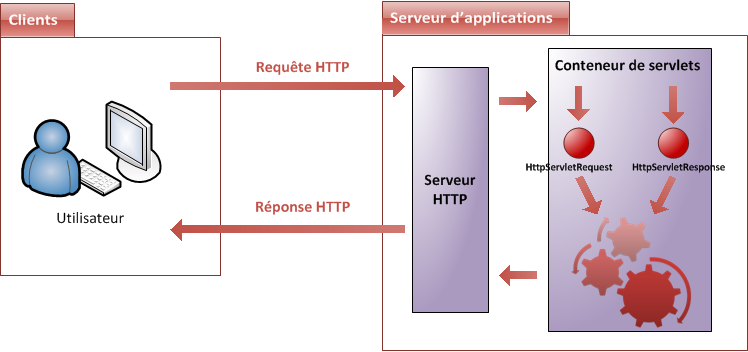

# La Servlet

Nous y voilà enfin ! Nous allons commencer par découvrir ce qu'est une servlet, son rôle au sein de l'application et comment elle doit être mise en place.
J'adopte volontairement pour ce chapitre un rythme assez lent, afin que vous preniez bien conscience des fondements de cette technologie.
Pour ceux qui trouveraient cela barbant, comprenez bien que c'est important de commencer par là et rassurez-vous, nous ne nous soucierons bientôt plus de tous ces détails !

## Derrière les rideaux

### Retour sur HTTP 

Avant d'étudier le code d'une servlet, nous devons nous pencher un instant sur le fonctionnement du protocole HTTP.
Pour le moment, nous avons simplement appris que c'était le langage qu'utilisaient le client et le serveur pour s'échanger des informations.
Il nous faudrait idéalement un chapitre entier pour l'étudier en détail, mais nous ne sommes pas là pour ça !
Je vais donc tâcher de faire court…

Si nous observions d'un peu plus près ce langage, nous remarquerions alors qu'il ne comprend que quelques mots, appelés méthodes HTTP.
Ce sont les mots qu'utilise le navigateur pour poser des questions au serveur.
Mieux encore, je vous annonce d'emblée que nous ne nous intéresserons qu'à trois de ces mots : **GET**, **POST** et **HEAD**.

#### GET

C'est la méthode utilisée par le client pour récupérer une ressource web du serveur via une URL.
Par exemple, lorsque vous tapez [www.openclassrooms.com](https://openclassrooms.com/fr/) dans la barre d'adresses de votre navigateur et que vous validez, votre navigateur envoie une requête GET pour récupérer la page correspondant à cette adresse et le serveur la lui renvoie.
La même chose se passe lorsque vous cliquez sur un lien.

Lorsqu'il reçoit une telle demande, le serveur ne fait pas que retourner la ressource demandée, il en profite pour l'accompagner d'informations diverses à son sujet, dans ce qui s'appelle les **en-têtes** ou **headers** HTTP : typiquement, on y trouve des informations comme la longueur des données renvoyées ou encore la date d'envoi.

Enfin, sachez qu'il est possible de transmettre des données au serveur lorsque l'on effectue une requête GET, au travers de paramètres directement placés après l'URL (paramètres nommés *query strings*) ou de cookies placés dans les en-têtes de la requête : nous reviendrons en temps voulu sur ces deux manières de faire.
La limite de ce système est que, comme la taille d'une URL est limitée, **on ne peut pas utiliser cette méthode pour envoyer des données volumineuses au serveur**, par exemple un fichier.

> Les gens qui ont écrit la norme décrivant le protocole HTTP ont émis des **recommandations d'usage**, que les développeurs sont libres de suivre ou non. Celles-ci précisent que via cette méthode GET, il est uniquement possible de **récupérer ou de lire** des informations, sans que cela ait un quelconque impact sur la ressource demandée : ainsi, une requête GET est censée pouvoir être répétée indéfiniment sans risques pour la ressource concernée.

#### POST

La taille du corps du message d'une requête POST n'est pas limitée, c'est donc cette méthode qu'il faut utiliser pour soumettre au serveur des données de tailles variables, ou que l'on sait volumineuses.
C'est parfait pour envoyer des fichiers par exemple.

Toujours selon les recommandations d'usage, cette méthode doit être utilisée pour réaliser les opérations qui ont un effet sur la ressource, et qui ne peuvent par conséquent pas être répétées sans l'autorisation explicite de l'utilisateur.
Vous avez probablement déjà reçu de votre navigateur un message d'alerte après avoir actualisé une page web, vous prévenant qu'un rafraîchissement de la page entraînera un renvoi des informations : eh bien c'est simplement parce que la page que vous souhaitez recharger a été récupérée via la méthode POST, et que le navigateur vous demande confirmation avant de renvoyer à nouveau la requête.

#### HEAD

Cette méthode est identique à la méthode GET, à ceci près que le serveur n'y répondra pas en renvoyant la ressource accompagnée des informations la concernant, mais **seulement ces informations**.
En d'autres termes, il renvoie seulement les en-têtes HTTP !
Il est ainsi possible par exemple de vérifier la validité d'une URL ou de vérifier si le contenu d'une page a changé ou non sans avoir à récupérer la ressource elle-même : il suffit de regarder ce que contiennent les différents champs des en-têtes.
Ne vous inquiétez pas, nous y reviendrons lorsque nous manipulerons des fichiers.

### Pendant ce temps-là, sur le serveur...

Rappelez-vous notre schéma global : la requête HTTP part du client et arrive sur le serveur.
L'élément qui entre en jeu est alors le **serveur HTTP** (on parle également de **serveur web**), qui ne fait qu'écouter les requêtes HTTP sur un certain port, en général le port 80.

> Que fait-il lorsqu'une requête lui parvient ?

Nous savons déjà qu'il la transmet à un autre élément, que nous avons jusqu'à présent qualifié de conteneur : il s'agit en réalité d'un conteneur de servlets, également nommé conteneur web (voir la figure suivante). 
Celui-ci va alors créer deux nouveaux objets :
* `HttpServletRequest` : cet objet contient la requête HTTP, et donne accès à toutes ses informations, telles que les en-têtes (*headers*) et le corps de la requête.
* `HttpServletResponse` : cet objet initialise la réponse HTTP qui sera renvoyée au client, et permet de la personnaliser, en initialisant par exemple les en-têtes et le corps (nous verrons comment par la suite).



> Et ensuite ? Que fait-il de ce couple d'objets ?

Eh bien à ce moment précis, c'est votre code qui va entrer en jeu (représenté par la série de rouages sur le schéma).
En effet, le conteneur de servlets va les transmettre à votre application, et plus précisément aux servlets et filtres que vous avez éventuellement mis en place.
Le cheminement de la requête dans votre code commence à peine, et nous devons déjà nous arrêter : qu'est-ce qu'une **servlet** ?

## Création

Une servlet est en réalité une simple classe Java, qui a la particularité de **permettre le traitement de requêtes et la personnalisation de réponses**.
Pour faire simple, dans la très grande majorité des cas une servlet n'est rien d'autre qu'une classe capable de recevoir une requête HTTP envoyée depuis le navigateur de l'utilisateur, et de lui renvoyer une réponse HTTP.

> En principe, une servlet dans son sens générique est capable de gérer n'importe quel type de requête, mais dans les faits il s'agit principalement de requêtes HTTP. Ainsi, l'usage veut qu'on ne s'embête pas à préciser "servlet HTTP" lorsque l'on parle de ces dernières, et il est donc extrêmement commun d'entendre parler de servlets alors qu'il s'agit bien en réalité de servlets HTTP. Dans la suite de ce cours, je ferai de même.

Un des avantages de la plate-forme Java EE est sa documentation : très fournie et offrant un bon niveau de détails, la [Javadoc](https://docs.oracle.com/javaee/7/index.html) permet en un rien de temps de se renseigner sur une classe, une interface ou un package de l'API Java EE.
Tout au long de ce cours, je mettrai à votre disposition des liens vers les documentations des objets importants, afin que vous puissiez facilement, par vous-mêmes, compléter votre apprentissage et vous familiariser avec ce système de documentation.

Regardons donc ce qu'elle contient au chapitre concernant [le package servlet](https://docs.oracle.com/javaee/7/api/javax/servlet/package-summary.html) : on y trouve une quarantaine de classes et interfaces, parmi lesquelles **l'interface nommée** [Servlet](https://docs.oracle.com/javaee/7/api/javax/servlet/Servlet.html).

En regardant celle-ci de plus près, on apprend alors qu'elle est **l'interface mère que toute servlet doit obligatoirement implémenter**.

Mieux encore, on apprend en lisant sa description qu'il existe déjà des classes de base qui l'implémentent, et qu'il nous suffit donc d'hériter d'une de ces classes pour créer une servlet.

Nous souhaitons traiter des requêtes HTTP, nous allons donc faire hériter notre servlet de la classe `HttpServlet` !
De retour sur votre projet Eclipse, faites un clic droit sur le répertoire `src`, puis choisissez `New > Class`. 
Renseignez alors le champ **package** par un package de votre choix.
Renseignez le nom de la servlet, puis cliquez ensuite sur le bouton `Browse...` afin de définir de quelle classe doit hériter notre servlet, puis allez chercher la classe `HttpServlet` et validez.
Voici le code que vous obtenez alors automatiquement :

```java
package com.sdzee.servlets;

import javax.servlet.http.HttpServlet;

public class Test extends HttpServlet {
    
}
```

Rien d'extraordinaire pour le moment, notre servlet étant absolument vide.
D'ailleurs puisqu'elle ne fait encore rien, sautons sur l'occasion pour prendre le temps de regarder ce que contient cette classe `HttpServlet` héritée, afin de voir un peu ce qui se passe derrière.
La Javadoc nous donne des informations utiles concernant le fonctionnement de cette classe : pour commencer c'est une classe abstraite, ce qui signifie qu'on ne pourra pas l'utiliser telle quelle et qu'il sera nécessaire de passer par une servlet qui en hérite.
On apprend ensuite que la classe propose les méthodes Java nécessaires au traitement des requêtes et réponses HTTP ! Ainsi, on y trouve les méthodes :
* `doGet()` pour gérer la méthode GET;
* `doPost()` pour gérer la méthode POST;
* `doHead()` pour gérer la méthode HEAD.

> Comment la classe fait-elle pour associer chaque type de requête HTTP à la méthode Java qui lui correspond ?

Vous n'avez pas à vous en soucier, ceci est géré automatiquement par sa méthode `service()` : c'est elle qui se charge de lire l'objet `HttpServletRequest` et de distribuer la requête HTTP à la méthode doXXX() correspondante.

Ce qu'il faut retenir pour le moment :
* une servlet HTTP **doit hériter** de la classe abstraite **HttpServlet**;
* une servlet **doit implémenter** au moins une des méthodes doXXX(), afin d'être capable de traiter une requête entrante.

> Puisque ce sont elles qui prennent en charge les requêtes entrantes, **les servlets vont être les points d'entrée de notre application web, c'est par elles que tout va passer**. Contrairement au Java SE, il n'existe pas en Java EE de point d'entrée unique prédéfini, comme pourrait l'être la méthode main()…

## Mise en place

Vous le savez, les servlets jouent un rôle très particulier dans une application.
Je vous ai parlé d'aiguilleurs en introduction, on peut encore les voir comme des gendarmes : si les requêtes étaient des véhicules, les servlets seraient chargées de faire la circulation sur le gigantesque carrefour qu'est votre application !
Eh bien pour obtenir cette autorité et être reconnues en tant que telles, les servlets nécessitent un traitement de faveur : il va falloir les enregistrer auprès de notre application.

Revenons à notre exemple.
Maintenant que nous avons codé notre première servlet, il nous faut donc un moyen de faire comprendre à notre application que notre servlet existe, à la fois pour lui donner l'autorité sur les requêtes et pour la rendre accessible au public !
Lorsque nous avions mis en place une page HTML statique dans le chapitre précédent, le problème ne se posait pas : nous accédions directement à la page en question via une URL directe pointant vers le fichier depuis notre navigateur.

> Mais dans le cas d'une servlet qui, rappelons-le, est une classe Java, comment faire ?

Concrètement, il va falloir configurer quelque part le fait que notre servlet va être associée à une URL.
Ainsi lorsque le client la saisira, la requête HTTP sera automatiquement aiguillée par notre conteneur de servlet vers la bonne servlet, celle qui est en charge de répondre à cette requête.
Ce "quelque part" se présente sous la forme d'un simple fichier texte : le fichier **web.xml**.

C'est le cœur de votre application : ici vont se trouver tous les paramètres qui contrôlent son cycle de vie.
Nous n'allons pas apprendre d'une traite toutes les options intéressantes, mais y aller par étapes.
Commençons donc par apprendre à lier notre servlet à une URL : après tous les efforts que nous avons fournis, c'est le minimum syndical que nous sommes en droit de lui demander !

Ce fichier de configuration doit impérativement se nommer **web.xml** et se situer juste sous le répertoire **/WEB-INF** de votre application.
Si vous avez suivi à la lettre la procédure de création de notre projet web, alors ce fichier est déjà présent.
Éditez-le, et supprimez le contenu généré par défaut.
Si jamais le fichier est absent de votre arborescence, créez simplement un nouveau fichier XML en veillant bien à le placer sous le répertoire **/WEB-INF** et à le nommer **web.xml**.
Voici la structure à vide du fichier :

```xml
<?xml version="1.0" encoding="UTF-8"?>
<web-app 
  xmlns="http://java.sun.com/xml/ns/javaee"
  xmlns:xsi="http://www.w3.org/2001/XMLSchema-instance"
  xsi:schemaLocation="http://java.sun.com/xml/ns/javaee http://java.sun.com/xml/ns/javaee/web-app_3_0.xsd"
  version="3.0">

</web-app>
```

L'intégralité de son contenu devra être placée entre les balises `<web-app>` et `</web-app>`.

> Pour le moment, ne prêtez pas attention aux nombreux attributs présents au sein de cette balise `<web-app>`, nous reviendrons sur leur rôle lorsque nous découvrirons les expressions EL.

**La mise en place d'une servlet se déroule en deux étapes : nous devons d'abord déclarer la servlet, puis lui faire correspondre une URL.**

### Définition de la servlet

La première chose à faire est de déclarer notre servlet : en quelque sorte il s'agit de lui donner une carte d'identité, un moyen pour le serveur de la reconnaître.
Pour ce faire, il faut ajouter une section au fichier qui se présente ainsi sous sa forme minimale :

```xml
<servlet>
	<servlet-name>[nom de la servlet]</servlet-name>
	<servlet-class>[package de la servlet].[nom de la servlet]</servlet-class>
</servlet>
```

La balise responsable de la définition d'une servlet se nomme logiquement <servlet>, et les deux balises obligatoires de cette section sont très explicites :
* `<servlet-name>` permet de donner un nom à une servlet. C'est ensuite via ce nom qu'on fera référence à la servlet en question.
* `<servlet-class>` sert à préciser le chemin de la classe de la servlet dans votre application. Ici, notre classe a bien pour nom le nom que vous lui avez donné et se situe bien dans votre package.

> **Bonne pratique** : gardez un nom de classe et un nom de servlet identiques. Bien que ce ne soit en théorie pas nécessaire, cela vous évitera des ennuis ou des confusions par la suite.

Il est par ailleurs possible d'insérer au sein de la définition d'une servlet d'autres balises facultatives :

```xml
<servlet>
	<servlet-name>[nom de la servlet]</servlet-name>
	<servlet-class>[package de la servlet].[nom de la servlet]</servlet-class>

	<description>Ma première servlet de test.</description>

	<init-param>
		<param-name>auteur</param-name> 
		<param-value>Coyote</param-value> 
	</init-param>

	<load-on-startup>1</load-on-startup>
</servlet>
```

On découvre ici trois nouveaux blocs :
* `<description>` permet de décrire plus amplement le rôle de la servlet. Cette description n'a aucune utilité technique et n'est visible que dans ce fichier;
* `<init-param>` permet de préciser des paramètres qui seront accessibles à la servlet lors de son chargement. Nous y reviendrons en détail plus tard dans ce cours;
* `<load-on-startup>` permet de forcer le chargement de la servlet dès le démarrage du serveur. Nous reviendrons sur cet aspect un peu plus loin dans ce chapitre.

### Mapping de la servlet

Il faut ensuite faire correspondre notre servlet fraîchement déclarée à une URL, afin qu'elle soit joignable par les clients :

```xml
<servlet-mapping>
	<servlet-name>[nom de la servlet donné dans le bloc <servlet>]</servlet-name>
	<url-pattern>/toto</url-pattern>
</servlet-mapping>
```

La balise responsable de la définition du mapping se nomme logiquement `<servlet-mapping>`, et les deux balises obligatoires de cette section sont, là encore, très explicites :
* `<servlet-name>` permet de préciser le nom de la servlet à laquelle faire référence. Cette information doit correspondre avec le nom défini dans la précédente déclaration de la servlet.
* `<url-pattern>` permet de préciser la ou les URL relatives au travers desquelles la servlet sera accessible. Ici, ça sera **/toto** !

> Pourquoi un "pattern" et pas simplement une URL ?

En effet il s'agit bien d'un pattern, c'est-à-dire d'un modèle, et pas nécessairement d'une URL fixe.
Ainsi, on peut choisir de rendre notre servlet responsable du traitement des requêtes issues d'une seule URL, ou bien d'un groupe d'URL.
Vous n'imaginez pour le moment peut-être pas de cas qui impliqueraient qu'une servlet doive traiter les requêtes issues de plusieurs URL, mais rassurez-vous nous ferons la lumière sur ce type d'utilisation dans la partie suivante de ce cours.
De même, nous découvrirons qu'il est tout à fait possible de déclarer plusieurs sections `<servlet-mapping>` pour une même section `<servlet>` dans le fichier **web.xml**.

> Que signifie "URL relative" ?

Cela veut dire que l'URL ou le pattern que vous renseignez dans le champ <url-pattern> sont basés sur **le contexte de votre application**.
Dans votre situation, pour le moment, la servlet répond donc à l'URL absolue `/[nom de votre projet]/toto`.

> L'ordre des sections de déclaration au sein du fichier est important : il est impératif de définir une servlet avant de spécifier son mapping.

## Mise en service
